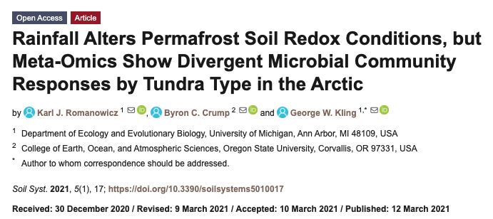
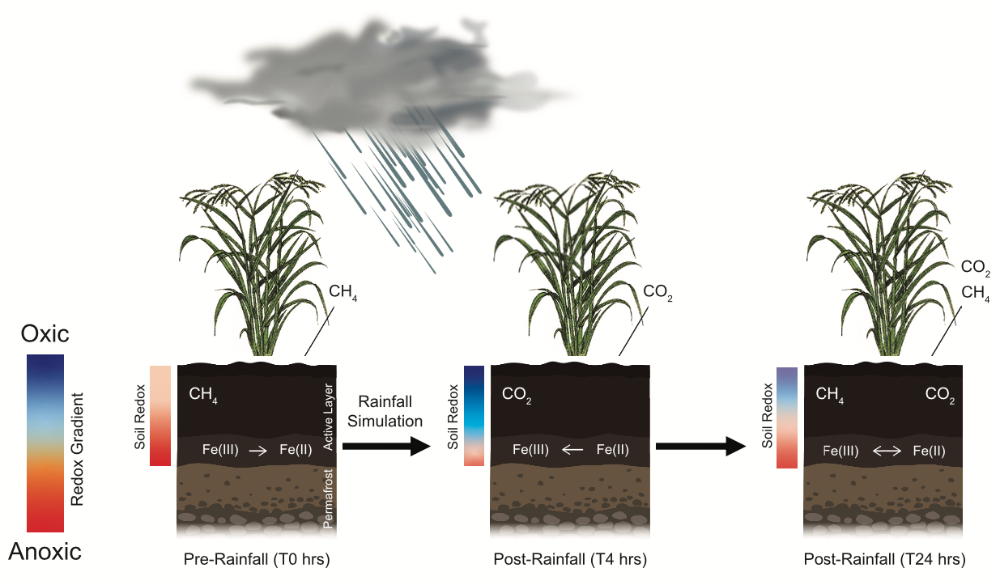
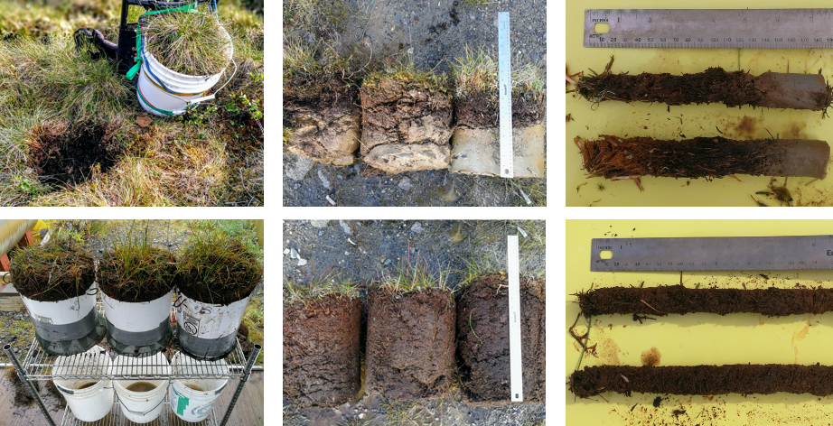

## Repository for: Romanowicz et al. 2021 (Soil Systems)
____________________________________________________________

Romanowicz, KJ, Crump, BC, Kling, GW. **(2021)** Rainfall alters permafrost soil redox conditions, but meta-omics show divergent microbial community responses by tundra type in the arctic. ***Soil Systems*** 5(1): 17. [https://doi.org/10.3390/soilsystems5010017](https://doi.org/10.3390/soilsystems5010017)

**Links to Rendered Code:** 
 
 [Geochemistry & 16S rRNA Analysis](https://rpubs.com/kjromano/SoilSystems21_16S_Analysis)
 
 [Metagenome Analysis](https://rpubs.com/kjromano/SoilSystems21_MG_Analysis)
 
 [Metatranscriptome Analysis](https://rpubs.com/kjromano/SoilSystems21_MT_Analysis)
 
 [Gas Chromatography Analysis](https://rpubs.com/kjromano/SoilSystems21_GC_Analysis)

**NCBI BioProject:** [PRJNA666429](https://www.ncbi.nlm.nih.gov/bioproject/?term=PRJNA666429) for raw .fastq files

***Soil Systems*** **Supplementary Material:** [https://www.mdpi.com/2571-8789/5/1/17/s1](https://www.mdpi.com/2571-8789/5/1/17/s1)

Direct any questions regarding this repository to lead author [Karl J. Romanowicz](mailto:kjromano@umich.edu).
____________________________________________________________

**Experimental Design**

This R Notebook provides complete reproducibility of the data analysis in ***"Rainfall alters permafrost soil redox conditions, but meta-omics show divergent microbial community responses by tundra type in the Arctic"*** by Romanowicz, Crump, and Kling. In this experiment, mesocosms containing soil from the active layer of two dominant tundra types were subjected to simulated rainfall to alter redox conditions.  The microbial functional potential (metagenomics) and gene expression (metatranscriptomics) patterns were measured during saturated anoxic redox conditions prior to rainfall and at multiple time points following the simulated rainfall event. Other measurements include soil properties as well as microbial respiration (CO2) and methane (CH4) production from soil subsamples collected at each sampling time point. The purpose was to determine if rainfall, as a form of soil oxidation, is sufficient to alter the anoxic redox conditions in arctic tundra and enhance the microbial degradation of organic carbon and CH4 to CO2.

**Conceptual Figure.**  A total of 12 tundra mesocosms (3 replicates x 2 tundra types x 2 sets of response cores) were acclimated initially under anoxic redox conditions to mimic field conditions (T0).  Dissolved oxygen was supplied to soils through the downward flow of oxygenated water during a simulated rainfall event.  Dissolved oxygen will likely change the redox gradient directly following rainfall (T4) as a short-term effect.  Anoxic conditions will likely be re-established after 24 hours (T24) as the pulse of oxygen is consumed through abiotic and biotic soil processes.  Under anoxic redox conditions (T0), microorganisms likely degrade organic carbon through anaerobic and fermentation pathways, producing CH4 and reducing Fe(III) to Fe(II).  Rainfall-induced soil oxidation (T4) should stimulate heterotrophic microorganisms that degrade organic carbon and CH4 through aerobic metabolic pathways, releasing CO2. Soil oxidation should also stimulate aerobic autotrophic iron oxidizing bacteria that oxidize Fe(II) to Fe(III) and convert CO2 into microbial biomass.  The long-term response (T24) will likely be a combination of aerobic and anaerobic metabolism as well as a combination of reduction and oxidation iron reactions as dissolved oxygen is consumed.  The predicted redox conditions and predicted redox reactions for coupled Fe(II)/Fe(III) cycling, as well as the microbial-induced release of CO2 or CH4 at each time point are based on the predicted availability of dissolved oxygen entering tundra soils through simulated rainfall.

**Soil Sampling for Microbial Gene Expression**

An initial soil sampling event for microbial activity was conducted at the end of the anoxic acclimation period (4-7 days) in all mesocosm replicates, representing sampling time point **T0**.  Mesocosms were then flushed to simulate a rainfall event.  Additional soil sampling events were conducted at **T4** (4-hrs) and **T24** (24-hrs) following the rainfall event to determine the temporal extent of microbial gene expression.  Soil cores (2.54 cm diameter, 30 cm length) were extracted in duplicate from each mesocosm replicate at each sampling time point and homogenized by depth in 10-cm increments.  The 10-20 cm soil increment, composed of organic soil in all mesocosm replicates, was chosen for microbial gene expression analysis and preserved in RNAlater Stabilization Reagent in sterile tubes at 4&deg;C for 18 hours and then stored at -80&deg;C until extraction.

**Field Experiment.** Tundra soil cores were collected from field sites in August 2017 (top left) and placed in buckets to establish the mesocosm experiment (bottom left).  Tussock tundra cores were composed of an organic soil layer overlying a mineral soil layer (top middle) while wet sedge tundra cores were composed entirely of organic soil (bottom middle).  Soil subsampling for microbial activity was taken from the 10-20 cm depth of duplicate soil cores in Tussock (top right) and Wet Sedge (bottom right).
